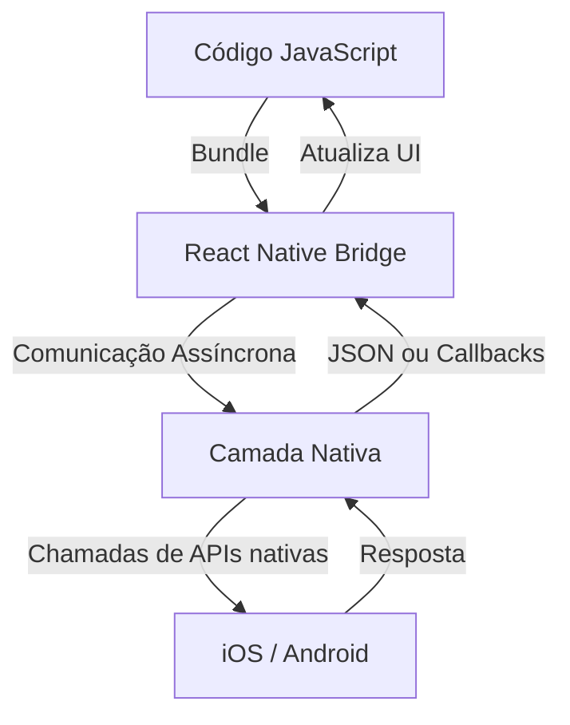

# Introdução ao `React Native`

> 1. Componentes: 
    
    O React Native usa componentes para construir a interface do usuário. Esses componentes são semelhantes aos componentes do React para a web, mas são adaptados para funcionar em dispositivos móveis. Exemplos de componentes incluem View, Text, Image, ScrollView, etc.

> 2. `Bridge`: 

    O React Native usa uma "ponte" (bridge) para comunicação entre o código JavaScript e o código nativo (Objective-C/Swift para iOS e Java/Kotlin para Android). Isso permite que o JavaScript chame APIs nativas e vice-versa.

> 3. `Hot Reloading`: 

    Uma das vantagens do React Native é o "Hot Reloading", que permite que você veja as mudanças no código refletidas imediatamente no aplicativo sem precisar recompilar o projeto.

> 4. Acesso a APIs Nativas:

     O React Native permite acesso a APIs nativas do dispositivo, como câmera, GPS, armazenamento local, etc., através de módulos específicos ou bibliotecas de terceiros.


> Criação de um projeto `React Native`:

> 1. Necessário `Node.js e npm`:
```bash
node -v 
npm -v
```

> 2. Instalação `React Native CLI`:
```bash 
npm install -g react-native-cli
```

> 3. Crie um novo projeto:
```bash
react-native init <ProjectName>
cd <ProjectName>
```

> 4. Execute o projeto:
```bash
npm start
```


> Estrutura de um projeto `React Native`:

```bash
<ProjectName>/
├── android/          # Código nativo para Android
├── ios/              # Código nativo para iOS
├── node_modules/     # Dependências do projeto
├── src/              # Pasta para o código fonte (opcional)
├── App.js            # Ponto de entrada do aplicativo
├── index.js          # Ponto de entrada para registro do aplicativo
├── package.json      # Configurações do projeto e dependências
└── ...
```

