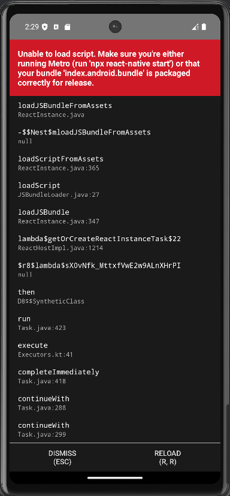

# Problemas encontrados

## 1. Erro de Versão do NDK no React Native

O erro ocorre quando há uma incompatibilidade entre a versão do NDK (Native Development Kit) configurada no seu ambiente de desenvolvimento e a versão esperada pelo projeto React Native.


### Causa:
O projeto React Native está configurado para usar uma versão específica do NDK (`27.1.12297006`), mas o ambiente de desenvolvimento está usando uma versão diferente (`28.0.13004108`). Essa discrepância pode causar problemas durante a compilação do código nativo.

### Como Resolver:

### 1. Verifique a Versão do NDK no Projeto
Abra o arquivo `android/app/build.gradle` e verifique a propriedade `android.ndkVersion`. Ela deve estar definida como:

```gradle
android {
    ndkVersion "27.1.12297006"
}

```

Caso você prefira usar a versão especificada no projeto (27.1.12297006), siga esses passos:

1. Abra o Android Studio.
2. Vá para "SDK Manager" (`File > Settings > Appearance & Behavior > System Settings > Android SDK`).
3. Clique na aba **"SDK Tools"**.
4. Marque a opção **"NDK (Side by side)"**.
5. Instale a versão **27.1.12297006**.
6. Ajuste o **ndk.dir** no **local.properties** para apontar para a versão correta (opcional).

## 2. Erro de caminho longo

**Problema:** O Windows tem um limite de 260 caracteres para caminhos de arquivos (conhecido como MAX_PATH). Se o projeto estiver aninhado em muitas pastas (por exemplo, C:\Users\SeuUsuario\Documents\senai\thirdSemester\mobileDevelopment\MeuApp), você pode atingir esse limite rapidamente, especialmente ao usar bibliotecas do Node.js que criam estruturas de pastas profundas (como node_modules).

**Solução:** Instalar o projeto na raiz do C: (por exemplo, C:\projetos\MeuApp) reduz significativamente o risco de atingir o limite de caminho.

## 3. Problemas com versões do Java e JDK

**Erro:** "Could not determine the dependencies of task ':app:compileDebugJavaWithJavac'".

**Solução:**

Certifique-se de que a versão do JDK instalada é compatível com a versão do React Native e Gradle.

- O react-native suporta as versões javaSDK acima da 11

Defina a variável JAVA_HOME corretamente:

```bash
  export JAVA_HOME=$(/usr/libexec/java_home -v 17)
```

## 4. Erro de Porta no React Native



### Problema

Ao tentar rodar um aplicativo React Native, a seguinte mensagem de erro foi exibida:

```bash 
warn No apps connected. Sending "reload" to all React Native apps failed. Make sure your app is running in the simulator or on a phone connected via USB.
```

Isso indica que o Metro Bundler não conseguiu se conectar ao aplicativo rodando no dispositivo ou emulador.

### Possível Causa

O problema pode estar relacionado à porta 8081, usada pelo Metro Bundler. Para verificar se a porta está ocupada, utilize o seguinte comando no terminal:

```bash
netstat -ano | findstr :8081
```

Se a porta estiver em uso, um processo pode estar impedindo a conexão correta.

### Solução

1. **Finalizar o processo ocupando a porta**

    1. Identifique o `PID` do processo que está usando a porta (coluna final da saída do comando `netstat`).
    2. Finalize o processo com o comando:

    ```bash
    taskkill /PID <PID_ENCONTRADO> /F
    ```

2. **Reiniciar o Metro Bundler**

```bash
npx react-native start --reset-cache
```

3. **Reiniciar o aplicativo no emulador ou dispositivo**

```bash
npx react-native run-android
```
Com esses passos, o erro deve ser resolvido e a conexão entre o Metro Bundler e o aplicativo deve funcionar corretamente.


## 5. Erro ao Resolver Plugin no Gradle

O erro que você está enfrentando ocorre ao tentar resolver o plugin `com.facebook.react.settings` no Gradle. Abaixo está uma análise detalhada do erro:

### Mensagem de Erro

> Error resolving plugin [id: 'com.facebook.react.settings']

> java.io.UncheckedIOException: Could not move temporary workspace (C:\ads-senai\thirdSemester\mobileDevelopment\MeuApp\android.gradle\8.10.2\dependencies-acces)


### Causa do Erro

O erro `java.io.UncheckedIOException` indica que houve um problema de I/O (entrada/saída) ao tentar mover um diretório temporário. Especificamente, o Gradle não conseguiu mover o diretório temporário localizado em:


Isso pode acontecer por vários motivos, como:

1. **Permissões de Arquivo**: O Gradle pode não ter permissão para acessar ou modificar o diretório temporário.
2. **Arquivos Bloqueados**: Outro processo pode estar bloqueando o acesso ao diretório ou arquivos dentro dele.
3. **Problemas de Disco**: Pode haver problemas no disco rígido, como corrupção de arquivos ou falta de espaço.
4. **Problemas de Rede**: Se o Gradle estiver tentando baixar dependências, problemas de rede podem causar falhas.

### Soluções Possíveis

Aqui estão algumas soluções que você pode tentar para resolver o problema:

1. **Verifique Permissões**:
   - Certifique-se de que o usuário que está executando o Gradle tem permissões de leitura e escrita no diretório `.gradle`.

2. **Libere Arquivos Bloqueados**:
   - Feche qualquer IDE ou processo que possa estar acessando o diretório `.gradle`.
   - Reinicie o computador para garantir que nenhum processo esteja bloqueando os arquivos.

3. **Limpe o Cache do Gradle**:
   - Tente limpar o cache do Gradle executando o seguinte comando no terminal:
     ```bash
     ./gradlew cleanBuildCache
     ```
   - Ou, se preferir, exclua manualmente o diretório `.gradle` dentro do projeto.

4. **Verifique Espaço em Disco**:
   - Certifique-se de que há espaço suficiente no disco rígido para o Gradle realizar suas operações.

5. **Verifique a Conexão de Rede**:
   - Se o Gradle estiver tentando baixar dependências, verifique se a conexão de rede está estável.

6. **Atualize o Gradle**:
   - Verifique se você está usando a versão mais recente do Gradle. Às vezes, problemas conhecidos são corrigidos em versões mais recentes.


